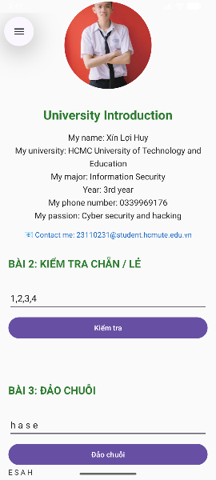

# MOBILE_PERSONAL_APP

## Introduction

**MOBILE_PERSONAL_APP** is a personal mobile application developed using **Android Studio**. It helps users manage daily activities efficiently with features like task tracking, reminders, and personal notes. The goal of this project is to provide a simple and convenient way to organize daily routines.

---

## User Interface Preview

Below is a preview of the web interface:



---

## Features

* Manage personal tasks and daily schedules
* Set reminders and notifications
* Create and edit personal notes
* Synchronize data between devices
* Simple and responsive web interface

---

## Technologies Used

* **IDE:** Android Studio
* **Language:** Java / Kotlin
* **UI Framework:** XML Layout
* **Database:** MySQL / Firebase
* **Version Control:** Git & GitHub

---

## How to Run

1. Clone the repository:

   ```bash
   git clone https://github.com/xinloihuy/MOBILE_PERSONAL_APP
   ```
2. Open the project in **Android Studio**.
3. Wait for Gradle to finish building the project.
4. To run the app:

   * **Option 1:** Use the **Android Virtual Device (AVD)** emulator.
   * **Option 2:** Connect a **real Android device** via USB and enable **USB Debugging**.
5. Click **Run ▶** in Android Studio to build and launch the app.

---

## Author

**Name:** Xín Lợi Huy
**Email:** [23110231@student.hcmute.edu.vn](mailto:23110231@student.hcmute.edu.vn)
**Phone Number:** 0339969176

---
